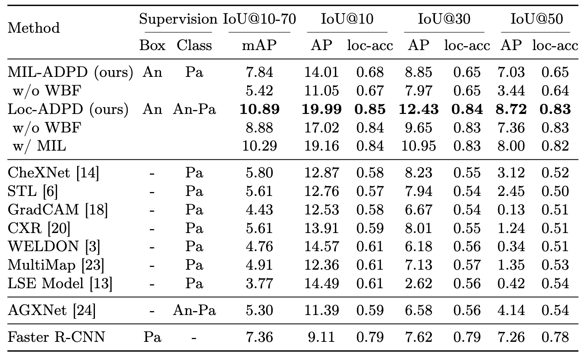

# Anatomy-Driven Pathology Detection on Chest X-rays

Pathology detection enables the automatic interpretation of medical scans such as chest X-rays while providing a high level of explainability to support radiologists in making informed decisions.
However, annotating pathology bounding boxes is a time-consuming task such that large public datasets for this purpose are scarce. Current approaches thus use weakly supervised object detection to learn the (rough) localization of pathologies from image-level annotations, which is however limited in performance due to the lack of bounding box supervision. 
We, therefore, propose  anatomy-driven pathology detection (ADPD), which uses easy-to-annotate bounding boxes of anatomical regions as proxies for pathologies. 
We study two training approaches: supervised training using anatomy-level pathology labels and multiple instance learning with image-level pathology labels. Our results show that our anatomy-level training approach outperforms weakly supervised methods and fully supervised detection with limited training samples, and our MIL approach is competitive with both baseline approaches, therefore demonstrating the potential of our approach.

## Setup
You do not have to manually download any datasets, this will be done automatically. Just make sure you have a Physionet user with credentialed access to the relevant datasets (the dataset links will be prompted when you start training for the first time) and a Kaggle account. Then follow these steps:

1. Setup the conda/python environment by calling the following commands from the root dir of this project:
    

        conda env create -f environment.yml 
        pip install -e .

2. Setup W&B by setting the environment variables `WANDB_PROJECT` (specify the project name here, by default it's set to "adpd") and `WANDB_ENTITY` (e.g. your W&B username) such that training is logged to the correct project.

3. Specify a Physionet user by setting the environment variable `PHYSIONET_USER`. Make sure this user has credentialed access to all relevant datasets. The password will be asked when starting training for the first time, when the dataset will de downloaded automatically. The relevant dataset links will also be prompted before asking the password, so you can check that you have access to all of these datasests).

4. Make sure you have setup the Kaggle public API and have prepared the ``~/.kaggle/kaggle.json`` file (see https://www.kaggle.com/docs/api)

5. (Optional) Specify a dataset directory where datasets will be downloaded and stored by defining the environment variable ``DATA_DIR``. By default ``~/datasets``will be used.
You can also specify specific directories for MIMIC-CXR and CXR8 or point to already existing dataset folder. See ``src/settings.py`` for details.

6. (Optional) Specify a model directory by setting the environment variable `LOG_DIR`. By default ``"~/models/adpd`` will be used.

## Training and Evaluation
### Training
To train our model Loc-ADPD with default hyperparameters call

    python src/train.py +experiment=loc_adpd_densenet121

To train our model MIL-ADPD with default hyperparameters call

    python src/train.py +experiment=mil_adpd_densenet121

### Evaluation
By default, the model is evaluated automatically on the test set at the end of training. For hyperparameter tuning you can set this to the validation set by specifying ``eval_mode=test``. Later you can then manually evaluate the final model by calling

    python src/evaluate.py model_name=<model_name>

where ``<model_name>``is the specified name of your run (defined in the experiment config), e.g. ``loc_adpd``.

### Hyperparameters 
Hyperparameters can also be overwritten on the command line or by defining additional experiments in the folder ``conf/experiment``.
For possible experiment/training arguments have a look at ``ExperimentConfig``in ``src/utils/train_utils.py`` or look at default values in ``conf/train.yaml`` and the experiment configs in ``conf/experiment``. E.g. to overwrite the learning rate you can run

    python src/train.py +experiment=loc_adpd_densenet121 lr=1e-5

For possible model parameters have a look at ``AnatObservationClassifierConfig`` in ``src/model/observation_classifier/adpd.py`` or look at default values in the model configs ``conf/model/observation_classifier/loc_adpd_densenet121`` and ``conf/model/observation_classifier/mil_adpd_densenet121``.
E.g. to overwrite the model dimension you can run

    python src/train.py +experiment=loc_adpd_densenet121 model.d_model=1024

or to overwrite the number of decoder layers you can run

    python src/train.py +experiment=loc_adpd_densenet121 model.detector.n_decoder_layers=2

## Results

